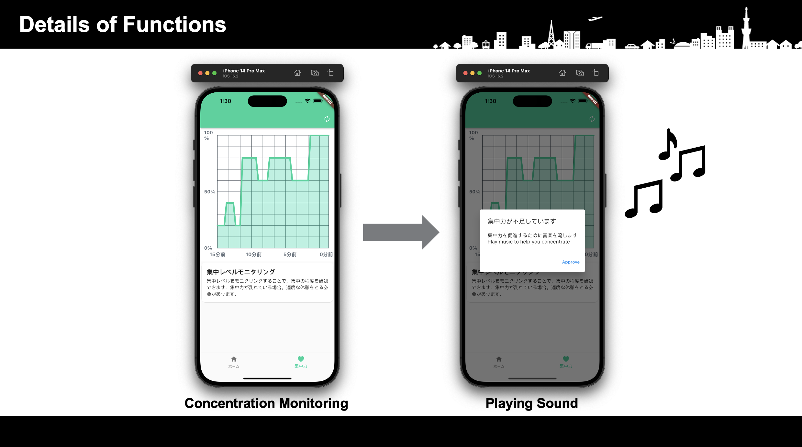

# m1_grandprix
M1グランプリ用

関節位置の動きから集中力を可視化し管理するモバイルアプリケーション

# システム構成図
## ローカルPC
- Realsense L515とNUITRACK SDKにより，デスク作業中のユーザの関節位置の情報を取得し，データをS3上にアップロード
## Webサーバ
- S3上にある骨格情報を学習済みランダムフォレストに適用することで，集中度合いを算出
- [EC2上のコード](https://github.com/s1534/aws_server)
## クライアント
- WebサーバにHTTPリクエストを送る
- 帰ってきたjsonをモバイルアプリケーション上でグラフとして描画し，集中力を可視化する

# システムの流れ
集中力がある一定の閾値を下回っていると，音楽を流して集中を促す

