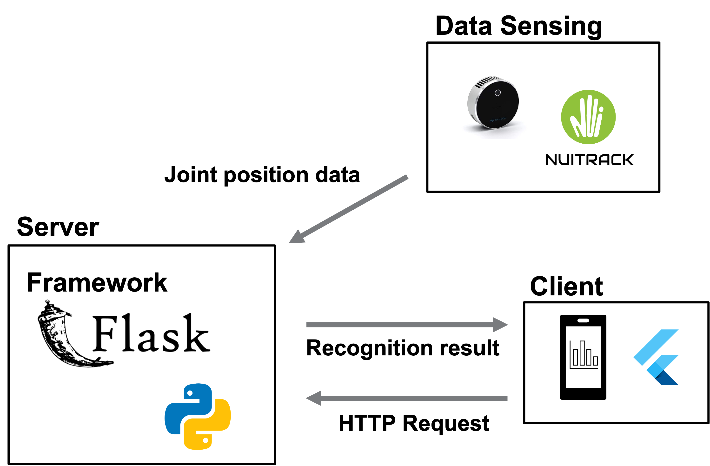
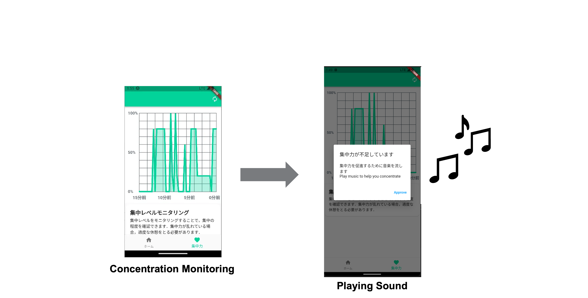

# m1_grandprix
M1グランプリ用

関節位置の動きから集中力を可視化し管理するモバイルアプリケーション

# システム構成図
Realsense L515とNUITRACK SDKにより，デスク作業中のユーザの関節位置の情報を取得し，関節位置の座標を学習済みランダムフォレストに適用することで集中度合いを算出．

# システムの流れ
集中力がある一定の閾値を下回っていると，音楽を流して集中を促す

